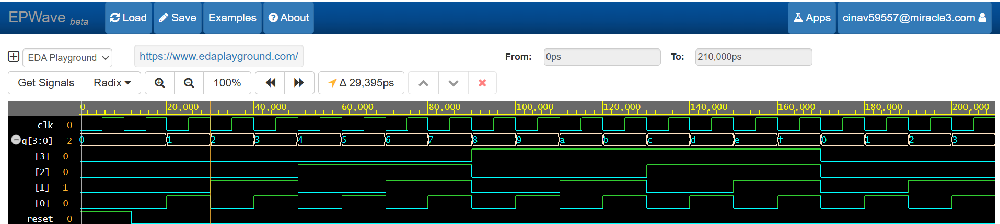
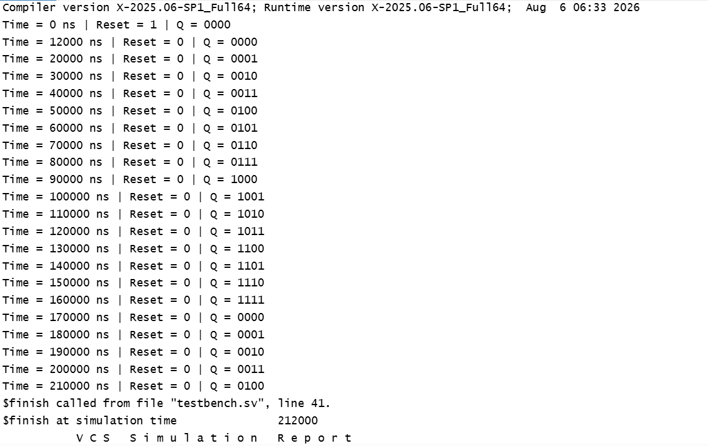

## 4-Bit Ripple Carry Counter

This project implements a 4-bit asynchronous (ripple) counter in Verilog HDL using T flip-flops constructed from D flip-flops.
The first flip-flop is driven by the external clock, while each subsequent flip-flop is clocked by the output of the previous stage, 
producing a binary count from 0000 to 1111. 
The design includes an active-high asynchronous reset to initialize the counter.

## Simulation Waveforms 

